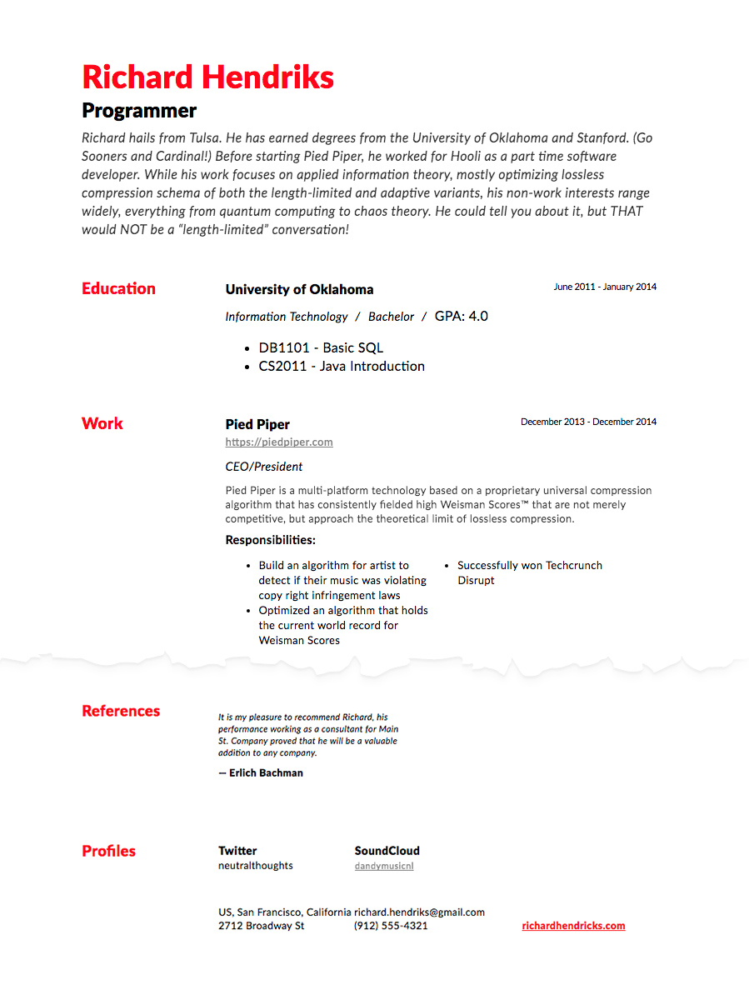

# jsonresume-theme-simple-red
Simple red theme for JSONResume. See it live.

## Demo




> [Online demo](https://rawgit.com/thibaudcolas/jsonresume-theme-eloquent/master/test/resume.html)

## Getting started

### Install the command line

Create your resume in json on [jsonresume](https://jsonresume.org)

The official [resume-cli](https://github.com/jsonresume/resume-cli) to run the development server.

Go ahead and install it:

```
sudo npm install -g resume-cli
```
### Install and serve theme

This is a theme for JSON Resume. It is available via npm:

```
npm install jsonresume-theme-simple-red
```

then change directory:

`cd node_modules/jsonresume-theme-simple-red/`

And simply run:

```
resume serve
```

You should now see this message:

```
Preview: http://localhost:4000
Press ctrl-c to stop
```

## License

Available under [the MIT license](http://mths.be/mit).
